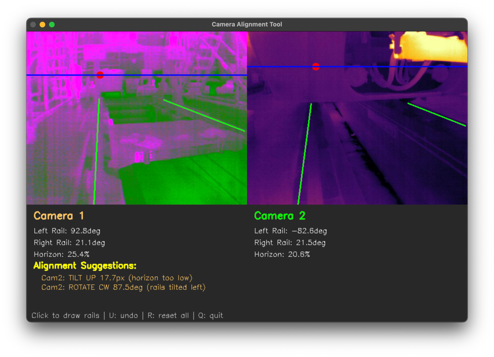

# Camera Alignment Tool

Interactive tool for comparing and aligning cameras using railheads.



## Requirements

```bash
pip install opencv-python numpy
```

## Usage

```bash
python camera_alignment_tool.py camera1.png camera2.png
```

**Controls:**
- **Click** - Draw rail lines (2 clicks per line, 2 lines per camera)
- **U** - Undo last action
- **R** - Reset all annotations
- **Q** - Quit
